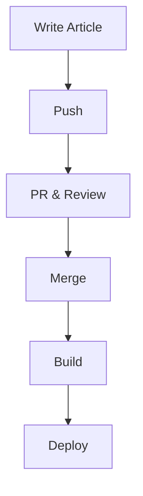

[](https://github.com/LaszloBogacsi/laszlobogacsi.github.io/actions/workflows/gh-pages.yml)

# Welcome to laszlobogacsi.com

This is my personal site, where I write some blog articles mainly aroud tech.

## Techstack

- Hugo SSG hugo `v0.145`
- Theme: Congo
- markdown

## Local Development

Build and serve, including draft posts
```shell
hugo server --buildDrafts
```
then visit:
```
http://localhost:1313/
```

## Deployment

- GitHub Actions


Workflow:


The output of the build phase is happening on `gh-pages` branch
